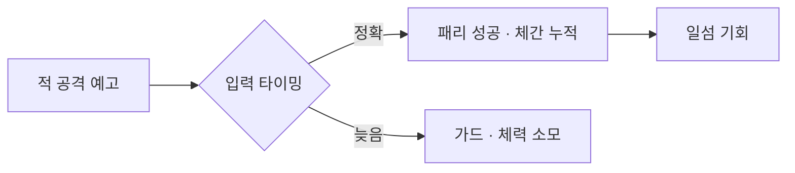

<!--
새 글 쓰는 법
1. 이 파일을 복사해서 _posts 폴더에 넣음
2. 파일 이름을 "날짜-영문이름.md"로 바꿈 (예: 2026-10-02-sekiro-posture.md)
3. 맨 위 title, game, topic, summary를 채움
   topic에 쓴 말이 그대로 목록 위 분류 탭이 됨 (새 말을 쓰면 탭이 새로 생김)
4. 이미지·GIF는 assets/clips 폴더에 올리고 아래처럼 파일 이름만 적으면 됨
-->

도입 두세 문단. 무엇을 관찰했고, 보통은 어떻게 되는데 이 게임은 왜 다른지.

## 소제목은 이렇게 (## 두 개 + 띄어쓰기)

관찰 → 추론 → 결론 순서로 짧은 문단 1~3개. 근거가 있으면 문장 끝에 번호.<sup><a href="#s1">1</a></sup>

**이미지 / GIF** (assets/clips 폴더에 올린 파일)



**유튜브 영상** (주소 watch?v= 뒤의 글자가 영상 ID)



**표** (아래 숫자는 예시)

| 구분 | 수치 | 비고 |
|---|---|---|
| 패리 판정 | 6프레임 | 첫 타 기준 |
| 캔슬 입력 창 | 5~6프레임 | 3타 막타 판정 종료 시점 |

**도식** (```mermaid 로 시작해서 ``` 로 닫으면 그림으로 바뀜)



## 정리

> 한두 문장 결론.

<div class="keypoint">
<p class="kp-label">내 기획에 가져갈 것</p>
<p>한 문단.</p>
</div>

<div class="sources">
<p><strong>출처</strong></p>
<ol>
<li id="s1"><a href="링크">출처 이름</a></li>
</ol>
</div>
